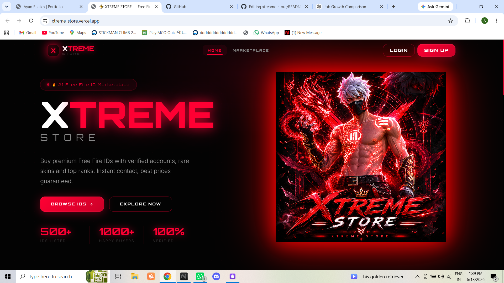
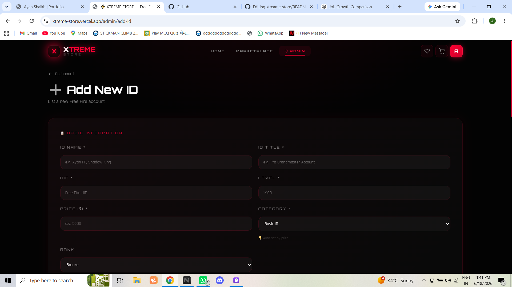
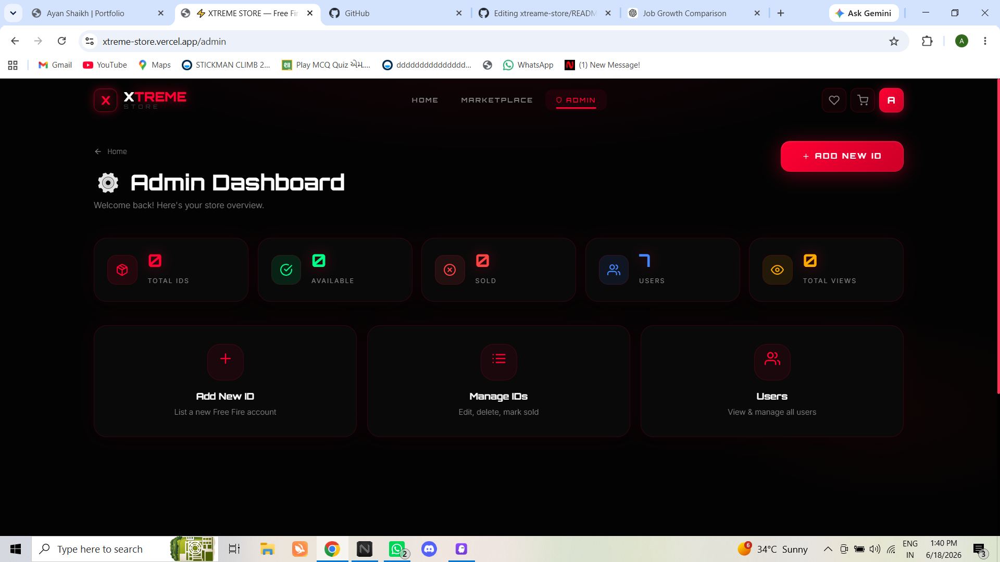

# ⚡ XTREME STORE

A modern full-stack gaming marketplace platform designed for buying and selling gaming IDs with secure authentication, advanced filtering, wishlist management, admin controls, and cloud-based media storage.

## 🌐 Live Demo

https://xtreme-store.vercel.app/

---

## 🚀 Features

### Authentication & Security

* User Registration & Login
* JWT Authentication
* Email OTP Verification
* Forgot Password System
* Password Encryption (bcrypt)
* Disposable/Fake Email Detection
* MX Record Validation

### Marketplace Features

* Browse Gaming IDs
* Search by Name & UID
* Category & Price Filters
* Featured & Trending Listings
* Wishlist Management
* Shopping Cart System
* Detailed Product Pages

### Admin Panel

* Dashboard Analytics
* Manage Users
* Add/Edit/Delete IDs
* Mark IDs as Sold/Available
* Media Upload Management
* Platform Statistics

### Media & Storage

* Cloudinary Image Upload
* Video Upload Support
* Optimized Media Delivery

---

## 🛠 Tech Stack

### Frontend

* React.js
* React Router
* Axios

### Backend

* Node.js
* Express.js

### Database

* MongoDB Atlas

### Authentication

* JWT
* bcrypt

### Cloud Services

* Cloudinary
* Gmail SMTP

### Deployment

* Vercel

---

## 📸 Screenshots

## 📸 Screenshots

### Home Page


### Login Page


### Add ID Page


### Admin Dashboard


---

## ⚙️ Installation

Clone the repository:

```bash
git clone https://github.com/your-username/xtreame-store.git
```

Install dependencies:

```bash
npm install
```

Run Backend:

```bash
cd server
npm run dev
```

Run Frontend:

```bash
cd client
npm run dev
```

---

## 📂 Project Structure

```text
XTREME-STORE
│
├── client
│   ├── src
│   ├── components
│   ├── pages
│   └── services
│
├── server
│   ├── controllers
│   ├── middleware
│   ├── models
│   ├── routes
│   └── utils
│
└── README.md
```

---

## 👨‍💻 Developer

Ayan Shaikh

B.Sc. IT (Cyber Security)

GitHub: https://github.com/ayanshaikh-1803
